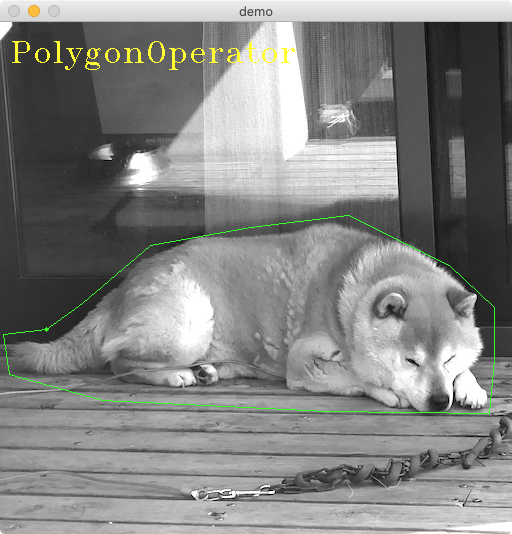

# cv2operator

cv2operator is a simple library to input various shapes like polygon rectangle and so on.



## Features

- **LineOperator**: input a line by mouse draggin
- **PolylineOperator**: input a polyline by click
- **PolygonOperator**: input a polygon by click
- **RectOperator**: input a rectangle by draggin
- **BrushOperator**: paint mask region by draggin
- **KeyOperator**: key management

## Usage

Here is a simple example.

```
import cv2
from cv2operator import KeyOperator, OperartorWindow, LineOperator

def line_cb(p1, p2):
    print(f"line: p1={p1}, p2={p2}")

image = cv2.imread("goru.jpg")
window = OperartorWindow("example", image)

line_op = LineOperator(window, callback=line_cb)

key_op = KeyOperator()
print(key_op.help())
key_op.main_loop()
```

## Operators

all operators are used in a example code.
see [demo.py](https://github.com/moicci/cv2operator/tree/master/examples/demo.py) in [examples](https://github.com/moicci/cv2operator/tree/master/examples).

### RectOperator


### LineOperator


### PolylineOperator


### PolygonOperator


### BrushOperator


